# Robot Planar Dibujante
Esta apliación que nos permite a partir de una imagen, ya sea por webcam o un archivo (.jpg, .jpeg), obtener las coordenadas cartesianas que le permitirán dibujar la imagen a un robot planar de 3 grados de libertad.

# Motivación
Este proyecto fue creado como un challenge para la evaluación final de la materia de Robótica (LMT4051-2). 

# Requerimientos
Para usar esta aplicación se necesitan los siguientes toolbox:
-  Robotic's Toolbox de Peter Corke (RVC 2nd edition: RTB10+MVTB4 (2017))
- Image Acquisition Toolbox Support Package for OS Generic Video Interface
- Image Acquisition Toolbox Supoort Package for DCAM Hardware
- Image Processing Toolbox
- Image Acquisition Toolbox
- MATLAB Support Package for USB Webcams

# Descripción de la interfaz
La interfaz generada en MATLAB se compone de los siguientes elementos:
- **Vista previa:** en esta figura podremos observar la imagen de la cámara, la captura de la misma o la imagen seleccionada. Así mismo, nos permite observar la imagen filtrada tras actualizar el filtro.
- **Selección de imagen:** Contiene las distintas opciones para la selección de imagen.
    * _Iniciar Cámara_ activa la cámara por default del sistema y transmite la imagen en vista previa.
    * _Capturar Imagen_ nos permite tomar una foto con la webcam.
    * _Seleccionar Imagen_ abre el explorador de archivos y nos permite seleccionar una imagen en los formatos *.jpg, o *.jpeg.
    * _Limpiar_ permite limpiar la figura de vista previa.
- **Procesamiento de imagen:** Contiene el control para la detección de bordes. 
    * Para la detección de bordes se utilizó un filtro Canny, el cual requiere de un pre-procesamiento con un filtro gaussiano. El slider _Sigma_ le permite al usuario modificar la magnitud del filtro gaussiano, lo que permite aumentar o disminuir la cantidad de bordes detectados.
    * _Actualizar filtro de pantalla_ nos permite previsualizar la imagen procesada de acuerdo al _Sigma_ seleccionado.
    * _Aceptar cambios_ nos permite guardar la configuración y es necesario presionarla antes de realizar cualquier animación. 
- **Animación:** Contiene las dos animaciones del robot disponibles.
    * _Animation_ik_ nos permite observar la animación del robot en una figura 2D de MATLAB. Esta animación utiliza elementos _SE2_ del toolbox de Peter Corke. 
    * _Animation_ik_TB_ nos permite observar la animación del robot generada por un objeto _Robot_ del toolbox de Peter Corke. Mientras el robot se encuentre dibujando, sólo es posible tener una vista superior; al finalizar el dibujo es posible rotar la figura para observar el robot en 3D. 

<em> Captura de pantalla de la interfaz </em>

# Funcionamiento
Como se mencionó anteriormente, es necesaria la descarga de diversos toolbox para el correcto funcionamiento del programa. En este caso, el Toolbox de Robótica de Peter Corke puede instalarse de diversas maneras como se puede observar en el siguiente [link](https://petercorke.com/toolboxes/robotics-toolbox/). Es posible que dependiendo de la instalación hecha, sea necesario correr el archivo _startup_rvc.c_ como primer paso; mediante este archivo será posible utilizar funciones del toolbox que se incluyen en _robotDibujante.m_. 

Una vez asegurados de que es posible hacer uso de las funciones del toolbox de Robótica y de haber descargado el repositorio, procedemos a abrir el archivo _robotDibujante.m_ en Matlab. Este archivo permitirá correr todo el programa y llamar a las funciones que se encuentran dentro de _Animation_ik_, _Animation_ik_, _edgeDetection_. 

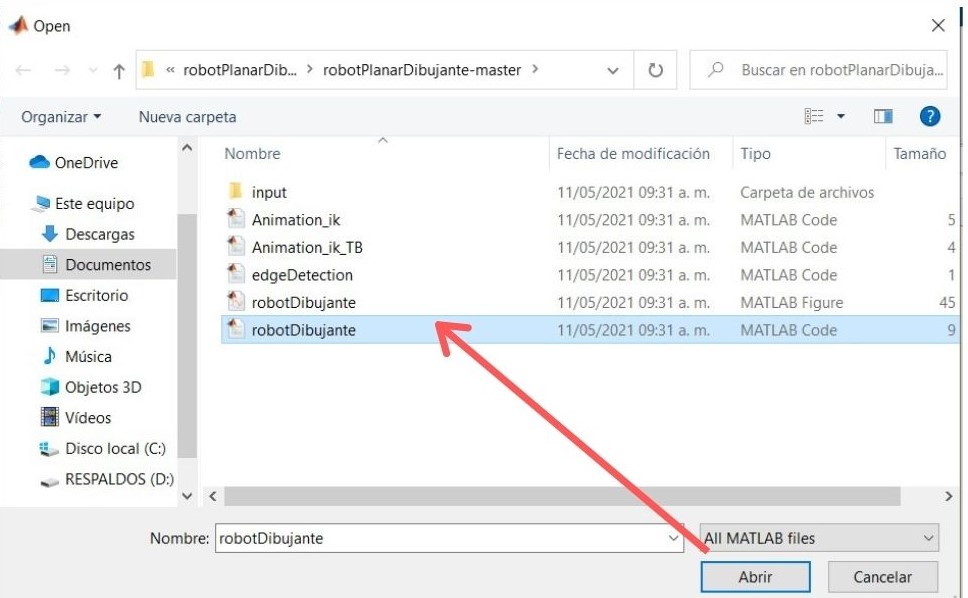

<em> Apertura del archivo _robotDibujante.m_ </em>

Ya que se ha abierto el archivo, únicamente basta con correr el código _robotDibujante.m_

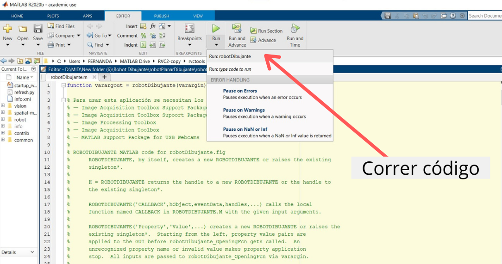

<em> Ejecución del programa _robotDibujante.m_ </em>

Al correr el código, aparecerá la interfaz gráfica del programa y podemos comenzar a hacer uso de los componentes mencionados anteriormente. 

<em> Captura de pantalla de la interfaz </em>

El primer paso dentro de la interfaz es elegir el archivo a dibujar, este archivo puede ser elegido directamente desde un archivo en nuestra computadora o de igual manera, es posible realizar la toma de una captura desde la cámara de la computadora. 

Si se desea tomar una fotografía desde la cámara, es necesario:

- 1: Presionar en _Inicializar Cámara_
- 2: Presionar en _Capturar Imagen_

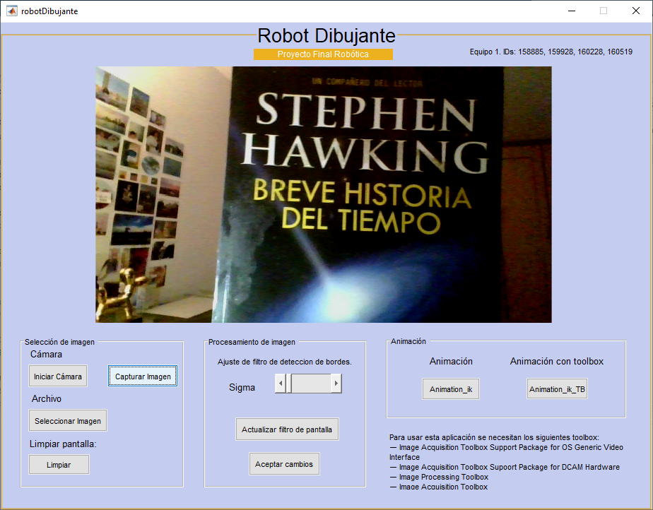

<em> Captura de una fotografía desde la cámara </em>

Si se desea elegir un archivo existente de nuestra computadora, es necesario:
- 1: Presionar en _Seleccionar Imagen_
- 2: Una vez presionado, se abrirá una nueva pestaña para buscar y seleccionar el archivo deseado (este debe ser .jpg o .jpeg)

Si hemos cometido un error en la selección del archivo o deseamos tomar otra fotografía, podemos hacer una limpieza de la imagen que se encuentra dentro de la interfaz con tan solo presionar el botón de _Limpiar_ y podemos volver a elegir la imagen nuevamente con los mismos pasos ya mencionados. 

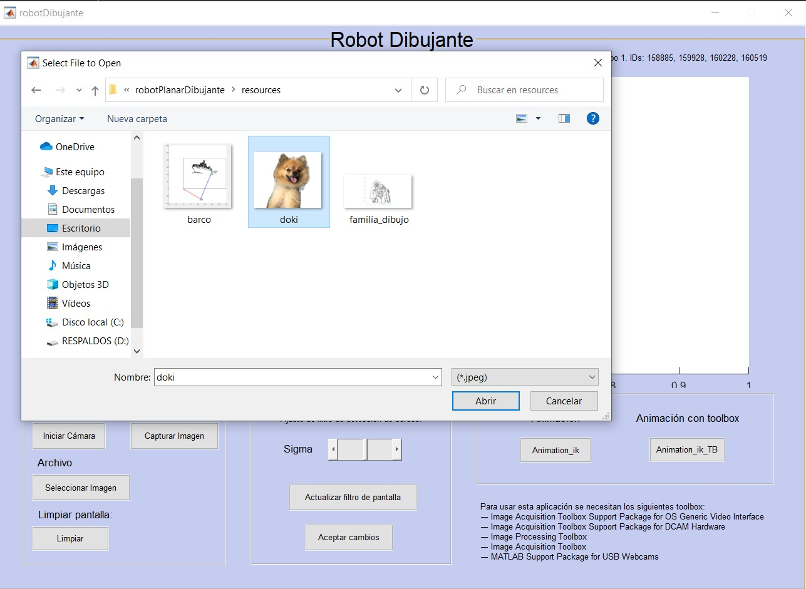

<em> Búsqueda del archivo a dibujar. </em>

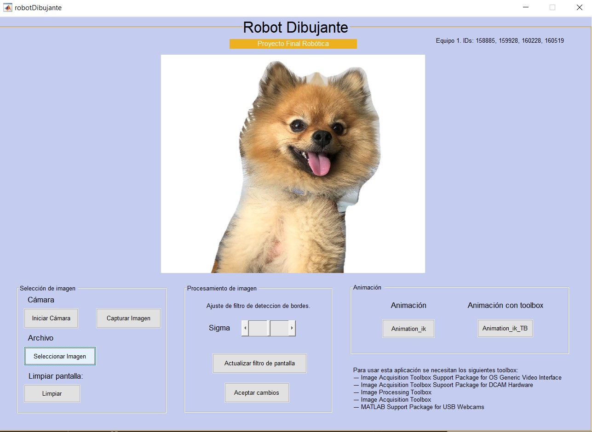

<em> Archivo seleccionado y abierto dentro de la interfaz. </em>

Una vez que ya tenemos la imagen a dibujar dentro de la interfaz, procedemos a aplicar el filtro de detección de bordes. Este filtro se aplica con el botón _Actualizar filtro de pantalla_ y su intensidad depende del slider denominado como _Sigma_. Cada que se modifique el valor del slider, es necesario volver a actualizar el filtro para poder observar los cambios de la imagen. Dependiendo del valor en el slider, se modificará la detección de los bordes como se observa a continuación. 

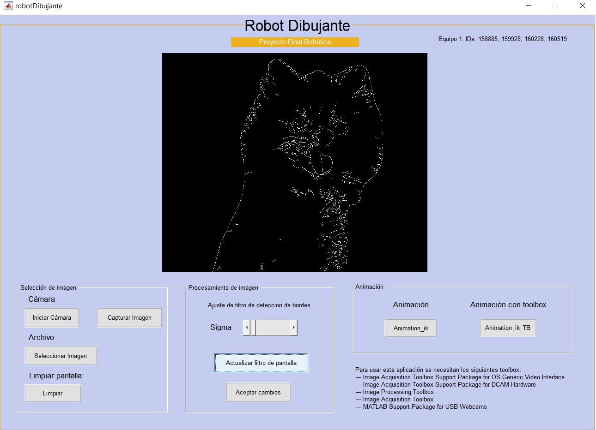

<em> Ejemplo 1 de ajuste de filtro. </em>

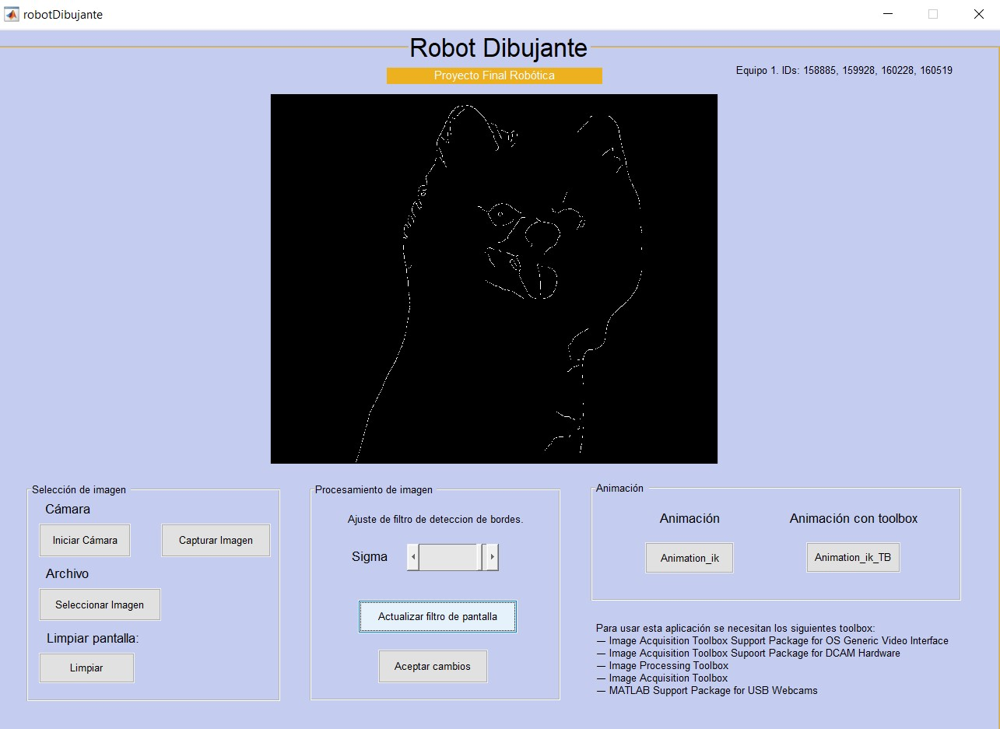

<em> Ejemplo 2 de ajuste de filtro. </em>

Ya que se haya elegido el valor final del filtro, es posible proceder a dibujar la imagen. La imagen se puede dibujar con una animación de un robot de 2 dimensiones simple o generado mediante el Toolbox de Peter Corke. Para comenzar el dibujo, es necesario:

- 1: Presionar en _Aceptar cambios_
- 2: Elegir _Animación_ik_ o _Animación_ik_TB_

Una vez hechos estos pasos, se desplegará una nueva figura en donde se mostrará el proceso de dibujo de la imagen seleccionada. 

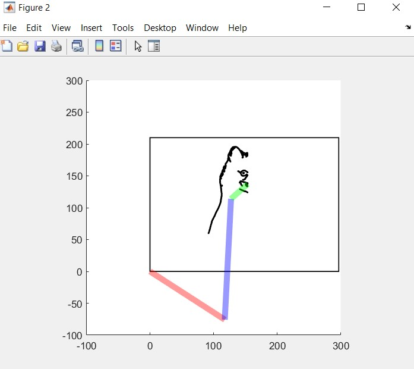

<em> Proceso de dibujo de la imagen sin toolbox </em>

Es importante mencionar que existe una notoria diferencia en el tiempo de dibujo entre la animación con toolbox y sin toolbox. Se recomienda elegir la animación sin toolbox para menor tiempo de dibujo, esto se debe a que el uso del toolbox requiere un alto consumo de recursos por parte de la computadora. 

Una vez terminado el dibujo, es posible guardar el la figura final en diferentes formatos.

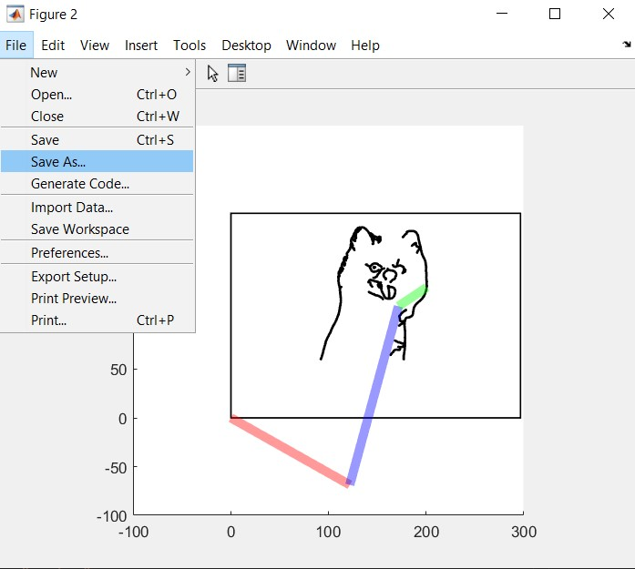

<em>  Guardar dibujo finalizado </em>

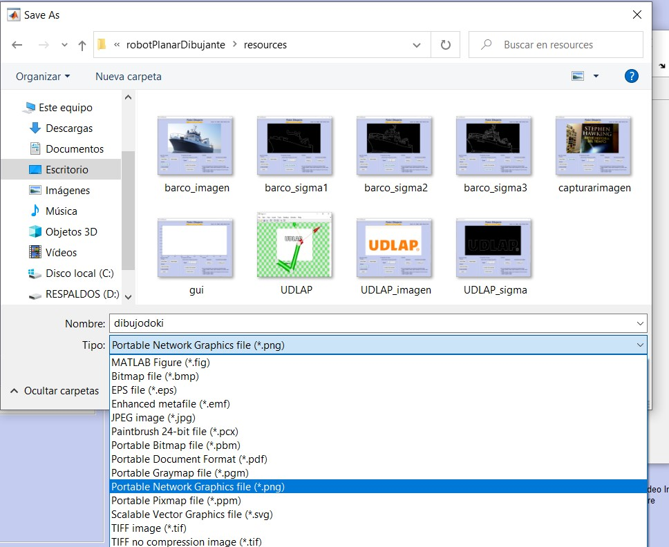

<em> Elegir formato del dibujo a guardar. </em>

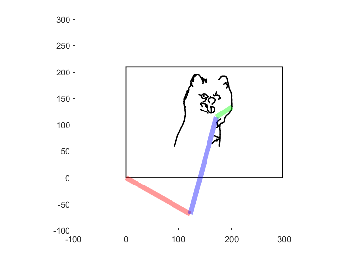

<em> Dibujo finalizado en formato .png</em>

El proceso puede interrumpirse si se cierra la figura en donde se está dibujando la imagen. Igualmente, el proceso puede volver a comenzarse siguiendo los mismos pasos una vez finalizado. Si la imagen originalmente se dibuja con _Animación_ik_ y al finalizar el proceso, se desea dibujarla ahora con _Animación_ik_TB_, no es necesario volver a abrir la imagen en la interfaz si esta ya está abierta, únicamente es necesario volver a presionar _Aceptar cambios_ y elegir el nuevo tipo de animación. 

# Pruebas
Pueden encontrarse videos del funcionamiento de esta aplicación para distintos casos en el siguiente [link](https://youtu.be/5BYJgvd3Z4k).

A continuación mostramos un ejemplo del resultado de una imagen en 3D.

<em> Introducción de la imagen a la aplicación. </em>

<em> Procesamiento de la imagen para tres valores distintos de sigma. </em>

<em> Resultado de la imagen dibujada con la simulación planar. </em>

Por otro lado, también es posible imprimir imágenes como logotipos o documentos escaneados, como se muestra a continuación.

<em> Introducción del logotipo a la aplicación. </em>

<em> Procesamiento del logotipo. </em>

<em> Resultado de la imagen dibujada con la simulación con robot del toolbox. </em>

# Autoría
Este proyecto fue creado por el Equipo 1 de la materia de Robótica en el periodo Pimavera 2021. El equipo está conformado por:
- María Fernanda López Salinas, Ingeniería Mecatrónica.
- Zuriel Enrique González López, Ingeniería Mecatrónica.
- Adrián Ramos Macías, Ingeniería Mecatrónica.
- Ana María Ruiz Fernández, Ingeniería Mecatrónica.