# Robot Planar Dibujante
Esta apliación que nos permite a partir de una imagen, ya sea por webcam o un archivo (.jpg, .jpeg), obtener las coordenadas cartesianas que le permitirán dibujar la imagen a un robot planar de 3 grados de libertad.

# Motivación
Este proyecto fue creado como un challenge para la evaluación final de la materia de Robótica (LMT4051-2) en el periodo Primavera 2021. 

# Requerimientos
Para usar esta aplicación se necesitan los siguientes toolbox:
-  Robotic's Toolbox de Peter Corke
- Image Acquisition Toolbox Support Package for OS Generic Video Interface
- Image Acquisition Toolbox Supoort Package for DCAM Hardware
- Image Processing Toolbox
- Image Acquisition Toolbox
- MATLAB Support Package for USB Webcams

# Descripción de la interfaz
La interfaz generada en MATLAB se compone de los siguientes elementos:
- **Vista previa:** en esta figura podremos observar la imagen de la cámara, la captura de la misma o la imagen seleccionada. Así mismo, nos permite observar la imagen filtrada tras actualizar el filtro.
- **Selección de imagen:** Contiene las distintas opciones para la selección de imagen.
    * _Iniciar Cámara_ activa la cámara por default del sistema y transmite la imagen en vista previa.
    * _Capturar Imagen_ nos permite tomar una foto con la webcam.
    * _Seleccionar Imagen_ abre el explorador de archivos y nos permite seleccionar una imagen en los formatos *.jpg, o *.jpeg.
    * _Limpiar_ permite limpiar la figura de vista previa.
- **Procesamiento de imagen:** Contiene el control para la detección de bordes. 
    * Para la detección de bordes se utilizó un filtro Canny, el cual requiere de un pre-procesamiento con un filtro gaussiano. El slider _Sigma_ le permite al usuario modificar la magnitud del filtro gaussiano, lo que permite aumentar o disminuir la cantidad de bordes detectados.
    * _Actualizar filtro de pantalla_ nos permite previsualizar la imagen procesada de acuerdo al _Sigma_ seleccionado.
    * _Aceptar cambios_ nos permite guardar la configuración y es necesario presionarla antes de realizar cualquier animación. 
- **Animación:** Contiene las dos animaciones del robot disponibles.
    * _Animation_ik_ nos permite observar la animación del robot en una figura 2D de MATLAB. Esta animación utiliza elementos _SE2_ del toolbox de Peter Corke. 
    * _Animation_ik_TB_ nos permite observar la animación del robot generada por un objeto _Robot_ del toolbox de Peter Corke. Mientras el robot se encuentre dibujando, sólo es posible tener una vista superior; al finalizar el dibujo es posible rotar la figura para observar el robot en 3D. 

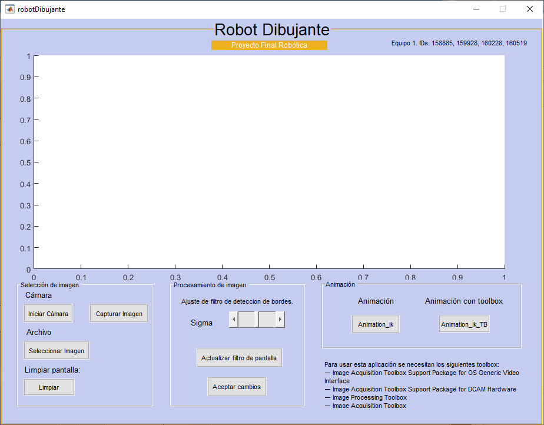

<em> Captura de pantalla de la interfaz </em>

# Funcionamiento
Esta es una prueba del funcionamiento

# Pruebas
Pueden encontrarse videos del funcionamiento de esta aplicación para distintos casos en el siguiente [link](https://youtu.be/5BYJgvd3Z4k).

A continuación mostramos un ejemplo del resultado de una imagen en 3D.

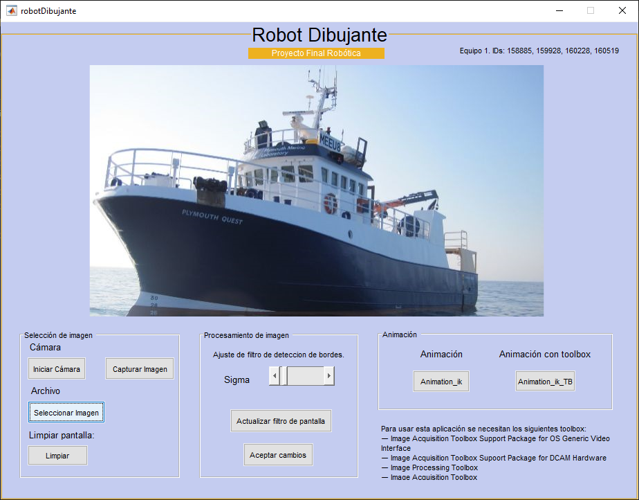

<em> Introducción de la imagen a la aplicación. </em>

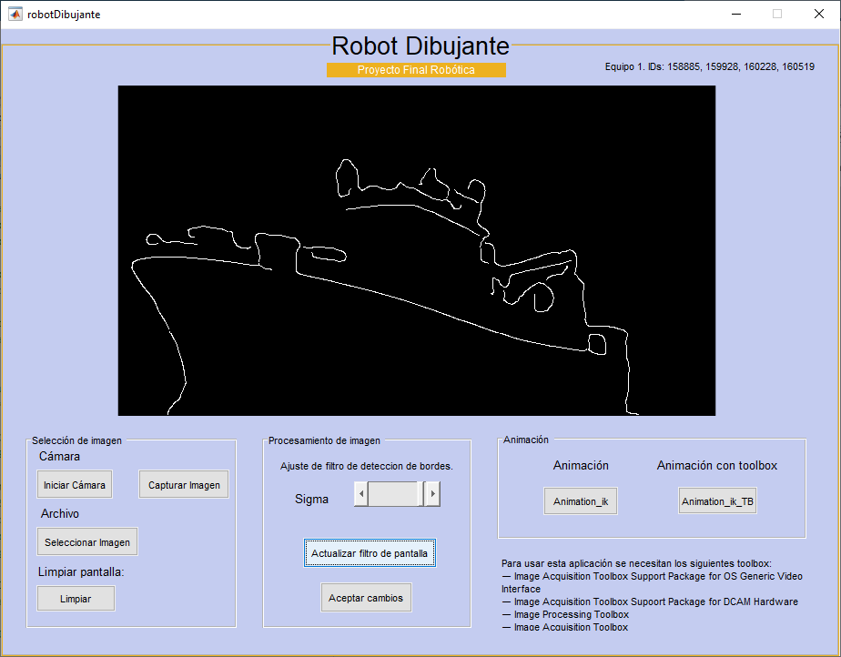
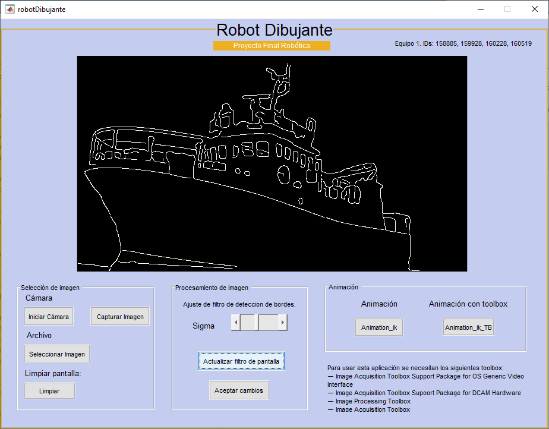
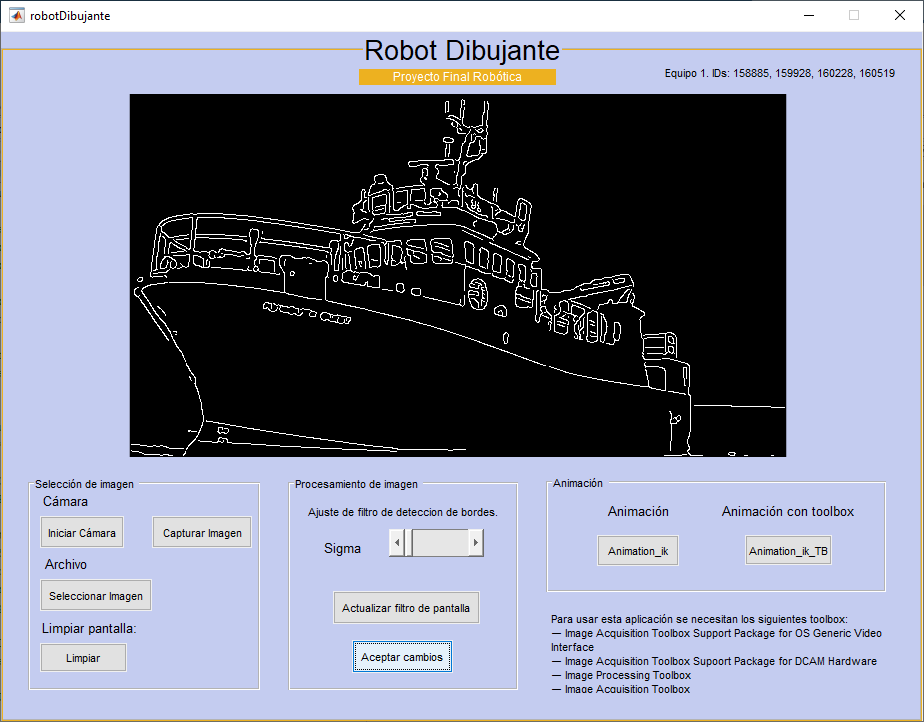

<em> Procesamiento de la imagen para tres valores distintos de sigma. </em>

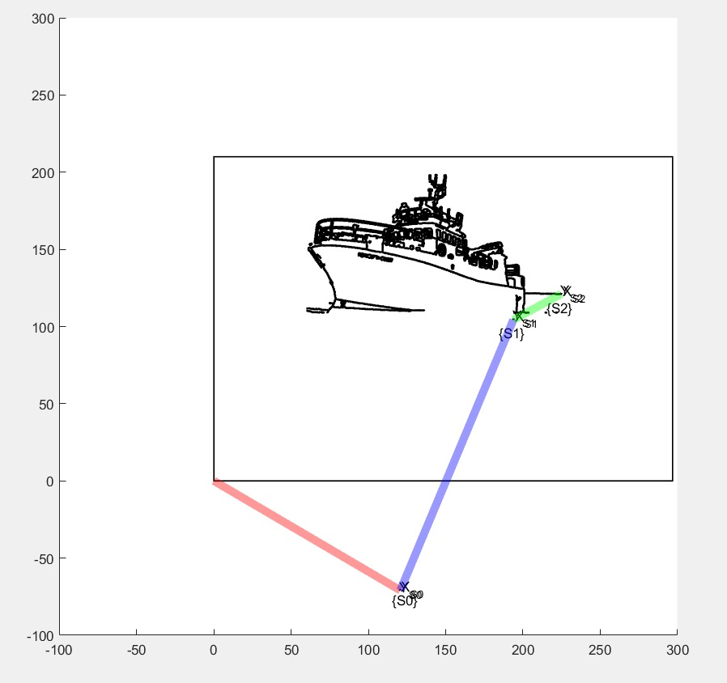

<em> Resultado de la imagen dibujada con la simulación planar. </em>

Por otro lado, también es posible imprimir imágenes como logotipos o documentos escaneados, como se muestra a continuación.

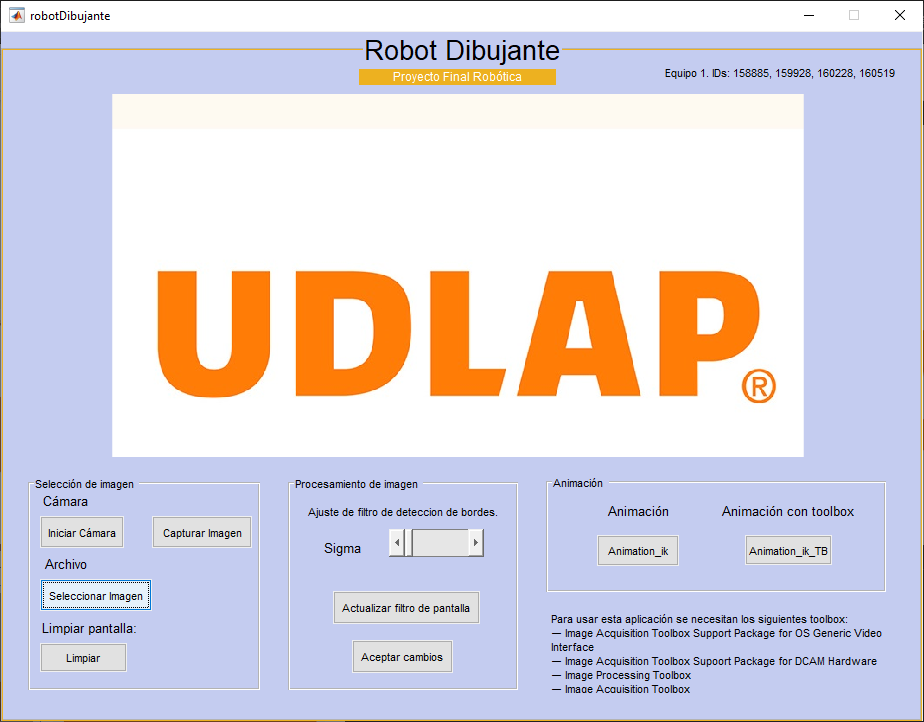
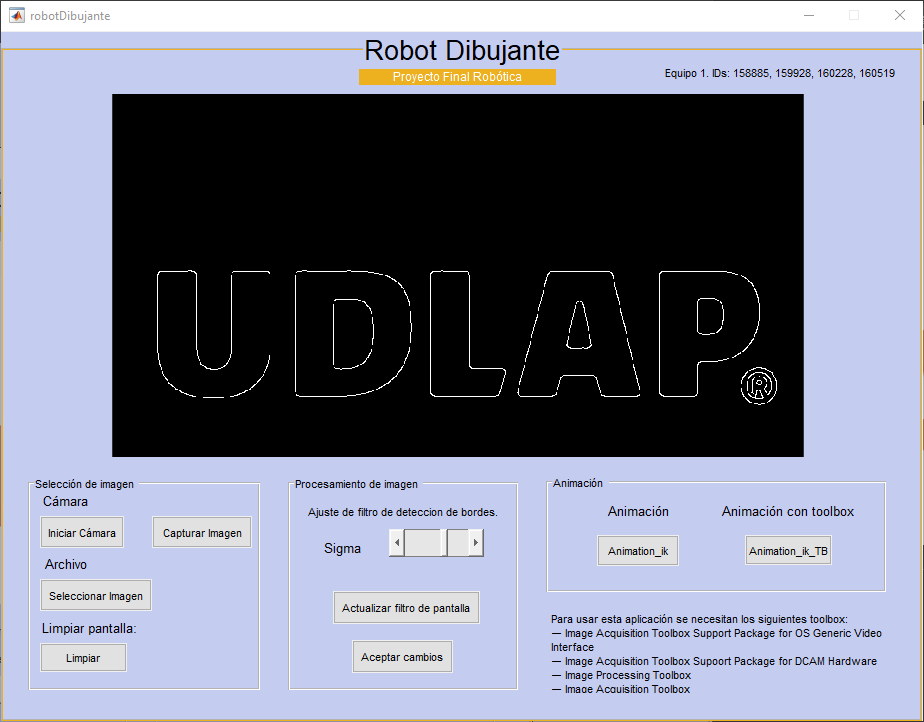

<em> Carga y procesamiento del logotipo. </em>

<em> Resultado de la imagen dibujada con la simulación con robot del toolbox. </em>

# Trabajo futuro
## Diseño Mecánico
El diseño mecánico del robot propuesto se muestra en la figura a continuación, en donde se indican las posiciones de los motores, así como la implementación de ruedas locas. Estos elementos brindarán soporte a los eslabones y al mismo tiempo permitirán que se puedan mover de manera correcta al momento en que se gira cada uno de ellos. 

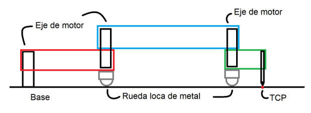

<em> Propuesta de diseño para el robot planar simulado. </em>

La estructura que se muestra está diseñada de tal forma para que ninguno de los eslabones choque entre sí al momento de que giren para poder realizar los dibujos. Esto se puede ver en las siguientes dos figuras donde se muestran las longitudes de los eslabones y cómo es que, al rotar 180 grados, estos no chocarían entre sí debido a la estructura que se propuso.

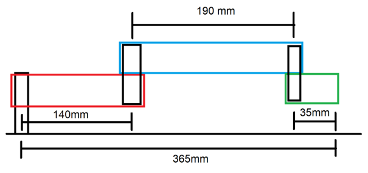
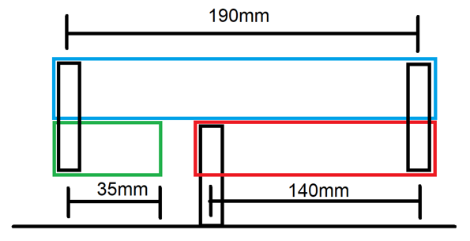

<em> Vista lateral del robot en su posición completamente extendida y completamente contraida. </em>

Otro aspecto importante en el que se podría trabajar es en la parte del TCP donde se colocaría el instrumento de dibujo del robot. Nuestra sugerencia es incluir algunos motores en esta sección para que el robot sea capaz de levantar un poco la punta cuando el TCP realice trayectorias sobre zonas donde no hay puntos que dibujar. De esta forma evitamos que el robot tenga que realizar un movimiento sobre el eje Z desde la base o del último eslabón para lograr el mismo objetivo. 

Finalmente, al ser un robot planar de tres eslabones, se podrían definir diferentes dimensiones para sus eslabones por lo que otro punto en el que se podría trabajar es en se cambiar las dimensiones propuestas. De esta forma se presentaría otro diseño de robot si es que se necesitara implementarse en distintas aplicaciones ya que el caso específico de este proyecto es para lograr dibujar dentro de una hoja A4 pero el código del robot permite cambiar las longitudes de los eslabones y de esta manera se modifica el workspace el robot. 

## Software
La versión actual del proyecto realiza el dibujo mediante una nube de puntos los cuales son graficados empleando la función `scatter`. Esto se debe a que al procesar la imagen esta es convertida en una matriz binaria. Empleando la función `find` se extraen las coordenadas en X y Y de los elementos que contienen un 1 binario. Sin embargo, la función `find` realiza el mapeo de tales elementos revisando cada renglón de una columna en la matriz. Es por eso que el robot realiza el dibujo con un comportamiento similar a una impresora ya que va plasmando los puntos por columnas. 

Por lo tanto, para una futura versión del proyecto se recomienda implementar una función que permita unir los puntos en trayectorias. Idealmente se espera que el dibujo se realice según los trazos obtenidos en el procesamiento de la imagen y que estos se dibujen de manera continua. 

Otra sugerencia es revisar las zonas de indeterminación del robot. Específicamente en la función de `Animation_ik`, hay ocasiones en las que el eslabón 2 del robot actúa como si tuviera una longitud dinámica. Es decir, crece y decrece según la configuración articular que se presenta. Este error se rastreó hasta determinar que esto ocurre cuando los eslabones 2 y 3 se sobreponen, esto es cuando el grado de giro del eslabón 3 es de 180° con respecto al eslabón 2.

El error está directamente relacionado con la cinemática inversa, no es un problema de programación, lo que ocurre es que la cinemática inversa falla para las coordenadas X2 y Y2 con ciertos ángulos los cuales se presentan en las zonas de indeterminación. Es por eso que el dibujo se realiza a partir del milímetro 60 en el eje X ya que si los puntos se encuentran demasiado cerca del origen (la base) es muy probable que ocurra el error mencionado. 

Las zonas de indeterminación fueron reducidas drásticamente gracias al rediseño físico del robot en el cual los dos primeros eslabones tienen longitudes grandes con respecto al tercer eslabón. Sin embargo, esto no elimina por completo dichas zonas. Se pueden realizar múltiples pruebas con distintas longitudes de los eslabones indicando las nuevas longitudes en las variables `l1`, `l2` y `l3` de las funciones `Animation_ik` y `Animation_ik_TB`. 

Por otro lado, el diseño físico del robot permite tener ángulos de giro sin limitaciones, pero en caso de emplear un diseño diferente en el cual sea necesario establecer límites también será necesario programar tales límites. La versión actual del proyecto no tiene la capacidad de implementar límites ya que esto se debe aplicar desde la cinemática inversa para que esta no encuentre configuraciones articulares fuera de los límites. 

Finalmente, se detectaron retrasos en la captura de la imagen debido a la programación de la webcam. Estos retrasos se deben principalmente a que la forma en que se está activando y desactivando la cámara no toma en cuenta los desfases temporales que se producen al utilizar la función `snapshoot` para capturar la imagen. Si bien esto no afecta el funcionamiento general de la aplicación, puede dificultar el uso de la webcam.

Además, en relación con la cámara, consideramos que podría mejorarse la calidad de la imagen capturada introduciendo a la interfaz la opción de permitirle al usuario seleccionar entre distintas cámaras conectadas a su dispositivo, o modificando el contraste y brillo de la imagen. Es importante tomar esto en cuenta ya que, dependiendo en la calidad de la cámara, la iluminación al momento de la captura y el ruido en la imagen, la cantidad de puntos detectados puede variar.

# Autoría
Este proyecto fue creado por el Equipo 1 para materia de Robótica en el periodo Pimavera 2021. El equipo está conformado por:
- Zuriel Enrique González López (zuriel.gonzalezlz@udlap.mx), candidato a licenciatura en Ingeniería Mecatrónica (Graduación esperada 2022).
- María Fernanda López Salinas (maria.lopezss@udlap.mx, github: [ferzsal](https://github.com/ferzsal)), candidata a licenciatura en Ingeniería Mecatrónica (Graduación esperada 2022).
- Adrián Ramos Macías (adrian.ramosms@udlap.mx), candidato a licenciatura en Ingeniería Mecatrónica (Graduación esperada 2022).
- Ana María Ruiz Fernández (ana.ruizfz@udlap.mx, github: [amrf7](https://github.com/amrf7)), candidata a licenciatura en Ingeniería Mecatrónica (Graduación esperada 2022).