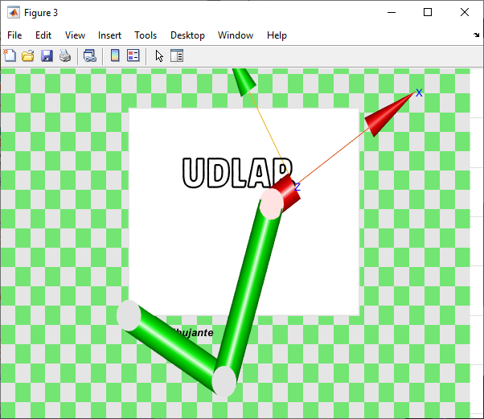

# Drawing planar robot

This app allows us to get the cartesian coordinates that will allow a 3-DOF planar robot to draw an image, which can be obtained by either a webcam or a file (.jpg, .jpeg).

Read this page in [Spanish](README.es.md).

# Motivation
This project was made as a challenge for the final ecvaluation of the Robotics (LMT4051-2) course in the Summer 2021 academic period.

# Requirements
To use this application, the following toolboxes are needed:
-  Robotic's Toolbox by Peter Corke (RVC 2nd edition: RTB10+MVTB4 (2017))
- Image Acquisition Toolbox Support Package for OS Generic Video Interface
- Image Acquisition Toolbox Supoort Package for DCAM Hardware
- Image Processing Toolbox
- Image Acquisition Toolbox
- MATLAB Support Package for USB Webcams

# Interface description
The MATLAB generated interface is composed by the following elements:
- **Vista Previa (Preview):** in this figure we'll be able to see the webcam view, the webcam capture or the selected image. It will also allow us to see the filtered image once the filter has been updated.
- **Selección de Imagen (Image selection):** Contains the different options for selecting the image.
    * _Iniciar Cámara_ (Start Camera) activates the system's default camera and transmits its view on the Preview screen.
    * _Capturar Imagen_ (Capture Image) allows us to take a webcam capture.
    * _Seleccionar Imagen_ (Select Image) opens the file explorer and allows us to select an immage in the formats *.jpg, or *.jpeg.
    * _Limpiar_ (Clean) allows us to clean the preview screen.
- **Procesamiento de imagen (Image processing):** Contains the controls for the border detection filter.
    * To detect borders a Canny filter was used, which requires a pre-processing gaussian filter. The _Sigma_ slider allows the user to modify the magnitude of the gaussian filter, which will increase or decrease the amount of noise in the image and, thus, the amount of borders detected.
    * _Actualizar filtro de pantalla_ (Update screen filter) allows us to preview the processed image according to the selected value for _Sigma_.
    * _Aceptar cambios_ (Accept changes) saves the current configuration, **this button must be pressed before starting the animation.**
- **Animación (Animation):** Contains the buttons for the two available robot animations.
    * _Animation_ik_ allows us to observe the animation of the robot in a 2D Matlab figure. This animation uses _SE2_ elements from Peter Corke's toolbox. 
    * _Animation_ik_TB_ allows us to see the animation generated by a _Robot_ object from Peter Corke's toolbox. While the robot is drawing it's only possible to have a top view, once the animation is completed, the robot can be rotated in 3D. 

<em> Interface screen capture </em>

# How does it work
As previously mentioned, it's necessary to download multiple toolboxes to ensure the proper functioning of this aplication. In this case, Peter Corke's Robotics Toolbox can be installed in different ways as explained in the following [link](https://petercorke.com/toolboxes/robotics-toolbox/). Depending on the installation method, you might have to run the file _startup_rvc.c_ beforehand; this will allow you to use functions from this toolbox that are required to run the file _robotDibujante.m_. 

Once you are sure that it's possible to use the Robotics Toolbox and that this repository is cloned into your working directory, you can open the file _robotDibujante.m_ in Matlab. This file will allow you to run the aplication and call the functions found in _Animation_ik_.m, _Animation_ik_TB.m and _edgeDetection.m_. 

<em> Opening the file robotDibujante.m </em>

Once the file is opened succesfully, you can run the file _robotDibujante.m_

<em> Running robotDibujante.m </em>

By running this file, a new window with our interface will open up. You can now make use of the previously explained components.

The first step is to select the image to draw, this file can be obtained from a file in our computer or from a webcam capture. If you wish to use the webcam, the following steps are required:
- 1: Press on _Inicializar Cámara_ (Start webcam)
- 2: Press on _Capturar Imagen_ (Capture image)

<em> Example of a webcam capture </em>

If you wish to select a file from your computer:
- 1: Press on _Seleccionar Imagen_ (Select image)
- 2: A file explorer window will pop up, find the desired image and select it (it must be in format .jp or .jpeg)

If a wrong image has been selected, we can clean the screen preview using the button _Limpiar_ and selecting a new image with any of the available methods.

<em> File explorer view. </em>

<em> Preview of the selected file. </em>

Once the image to draw has been selected, we can use the border detection filter. This filter is applied by pressing the button _Actualizar filtro de pantalla_ and its intensity can be affected by the value of the _Sigma_ slider. Each time the slider's value is modified, you must update the filter to preview the changes on the image. Here is an exampel of the same image processed with two different values of _Sigma_.

<em> Low sigma value example. </em>

<em> High sigma value example. </em>

Once the filter has been configurated to meet the user's requirements, it's possible to draw the image. This can be done through one of the provided animations: a simple 2D robot or a 3D robot object from Peter Corke's Robotics Toolbox. To start the animation you must:

- 1: Press on _Aceptar cambios_ (Accept changes)
- 2: Select _Animación_ik_ or _Animación_ik_TB_

Once this steps are completed, a new window will show the selected animation.

<em> 2D animation view </em>

It's important to mention that there is a clear differece between the drawing time of each animation type. We recomend to select the 2D animation for shorter drawing times, as the Robot object from the 3D animation consumes a larger amount of resources.

When the drawing is completed, the user can save the final figure in different formats.

<em>  Saving final drawing. </em>

<em> Selecting a format. </em>

<em> Final result in *.png format</em>

The process can be interrupted by closing the animation window. Similarly, the process can be restarted by repeating the same steps. If the image was initially drawn with amination _Animación_ik_ and by the end of the process you wish to draw it with the _Animación_ik_TB_ animation, it's not necessaty to select the same image again. You can only press _Aceptar cambios_ and select a different type of animation to begin the process.

# Testing
Videos showing the performance of this aplication with different cases can be found in the following [link](https://youtu.be/5BYJgvd3Z4k).

Here we show the results from a 3D image.

<em> Previewing the selected image. </em>

<em> Border detection for different sigma values. </em>

<em> Final drawing with the 2D animation. </em>

We can also draw logos or scanned documents, as shown in the following example.

<em> Image and border detection preview. </em>

<em> Final drawing with the 3D animation. </em>

# Future work
## Mechanical design
The mechanical design of the proposed robot is shown on the following figure, in which we can see the position of the motors as well as the implementation of the idlers. These elements will give support to the links and, at the same time, allow them to move correctly whenever a link rotates.

<em> Planar robot design proposal. </em>

The structure is designed in such way that none of the links clash with each other while drawing. This can be seen from the following figures, which show the length of the links and how, even by rotating 180°, they don't clash.

<em> Lateral view of the robot on its fully extended and fully contracted positions. </em>

Another important aspect that requires future work is the TCP, where the drawing instrument would be placed. Our suggestion is to use mottors that lift the tip of the TCP whenever it travels on trayectories without drawing points. This way we avoid movements on the Z-axis of the base or the last link to achieve the same objective.

Finally, it's possible to define different dimensions for the robot's links as future work—this can be done by changing it's values in the robot's code. This way, a new design can be proposed for different or specific applications. In this case, as seen before, the robot can only draw inside an A4 sheet, but the workspace can be modified by changing the length of the robot's links.

## Software
The current version of this project creates the "drawing" by obtaining a point cloud that is drawn using the function `scatter`. We are able to do this because the image to draw is first converted to a binary matrix and using MATLAB's function `find` extracts the X and Y coordinates of all elements containing a binary 1. Nevertheless, `find` creates a map of these elements by checking each row in all the columns in the matrix. For this reason, the robot creates the drawing similarly to a printer, as points are detected column by column.

As future work, we recomend the implementation of a function that allows us to join the points in trayectories. Ideally, the robot should continously draw these trayactories obtained form the image processing.

Another suggestion is to check the sections that the robot is not able to reach. Specifically in the function `Animation_ik`, as there are some cases in whick the robot's link 2 has dinamic length. In other words, the link's length changes according to the atricular configuration presented. This error was traced back to links 2 and 3 overlapping, whenever the link 3 rotates 180° with respect to link 2.

The error is directly related to inverse kinematics of this robot and is not a bug of error in the code, as the inverse kinematics fails to compute the coordinates X2 and Y2 for specific angles in the indetermination zones. Because of this, all drawings are drawn from milimmeter 60 in the X-axis, because in points that are too close to the origin—meaning, the base of the robot—, it's more likely to get this error.

These indetermination zones were minimized with the physical design proposed for the robot, in which the first two links have larger lengths compared to the third link. Regardless, this doesn't fully remove these zones. Testing different lengths can be done by modifying the lengths of the variables `l1`, `l2` and `l3` of functions `Animation_ik` and `Animation_ik_TB`. 

On the other hand, the physical design of the robot allows to have unlimited rotating angles, but when changing the desing is important to consider that angular limits  might need to be programmed. The current version of this proyect does implement these limits as this has to be implemented from the inverse kinematics so that no angular configurations outside of these limits can be found.

Finally, we noticed that there was some delay in thr image capture with the webcam due to its programming. These delays are mostly due to the way the webcam is activating and deactivatinf without considering the time-shifts caused by using the function `snapshoot` to capture the image. While this doesn't affect the overall performance of the application, it may complicate the use of the webcam. A possible solution is to substitute the activation of the webcam—using the function `videoinput`— by the function `webcam`, however, it's necessary to find an adequate method to turn off the webcam after capturing the image. 

In relation to the webcam, we also find that the quality of the image can be improved by allowing the usr to select any of the cameras connected to the device, or by modifying the contrast and lightness of the image. It's important to take this into account as, depending on the quality of the camera, the lightning by the time of capture and the amount of noise in the image, the amount of points in the cloud used to creeate the drawing may vary. 

# About the authors
This project was created by Team 1 for the Robotics course in the 2021 Spring semester at UDLAP. The team members are:
- Zuriel Enrique González López (zuriel.gonzalezlz@udlap.mx), candidate for the Bachelor's Degree in Mechatronics Engineering (Expected graduation in  2022).
- María Fernanda López Salinas (maria.lopezss@udlap.mx, github: [ferzsal](https://github.com/ferzsal)), candidate for the Bachelor's Degree in Mechatronics Engineering (Expected graduation in  2022).
- Adrián Ramos Macías (adrian.ramosms@udlap.mx), candidate for the Bachelor's Degree in Mechatronics Engineering (Expected graduation in  2022).
- Ana María Ruiz Fernández (ana.ruizfz@udlap.mx, github: [amrf7](https://github.com/amrf7)), candidate for the Bachelor's Degree in Mechatronics Engineering (Expected graduation in  2022).

# Additional resources 
In the following [link](https://drive.google.com/drive/folders/1JFphu5fYnkcF-Y_q62HlObDaAQS4sMIE?usp=sharing) it's possible to find the report for this project (in Spanish), related to the kinematic analysis of the planar robot. Additionaly, as a personal recommendation, we suggest the revision og the following [project](https://la.mathworks.com/matlabcentral/fileexchange/67926-portrait-drawing-using-computer-vision-and-robot-manipulator) by Tohru Kikawada, related to the generation of portraits from facial detection through a webcam.